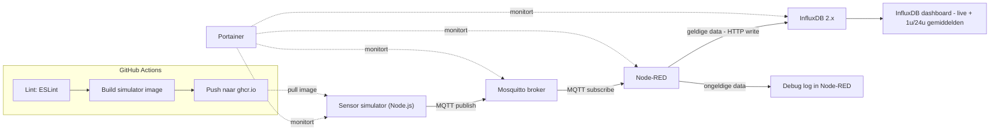

# Smart Sensor Gateway

Edge-systeem dat een afstandssensor en een lichtsensor simuleert, de metingen
via MQTT verzamelt, valideert en verwerkt met Node-RED, opslaat in InfluxDB,
visualiseert in een dashboard, en centraal beheert met Portainer. Het volledige
systeem draait in Docker-containers via Docker Compose.

**Gemaakt door:** Bram De Bevere — Vives

## Architectuur



**Dataflow:** de simulator doet zich voor als een afstandssensor en lichtsensor,
en publiceert elke seconde een JSON-bericht op twee MQTT-topics:
`sensor/distance` (afstand in cm) en `sensor/light` (lichtsterkte in lux).
Node-RED abonneert op beide topics, valideert elke meting in een zelfgeschreven
function node (geldig bereik: 0-400 cm voor afstand, 0-1000 lux voor licht), en
stuurt **enkel geldige metingen** door naar InfluxDB via de HTTP write-API.
Ongeldige metingen worden niet opgeslagen, maar gelogd in een debug-node.

De simulator genereert met opzet in ~5% van de gevallen een ongeldige waarde
(bv. een negatieve afstand), zodat de validatielogica in Node-RED aantoonbaar
iets doet — zonder foutieve data zou je nooit zeker weten of de filtering
effectief werkt.

## Installatie

### Vereisten
- VirtualBox met een Debian-VM (getest met Debian 13 "Trixie"), netwerk ingesteld
  op NAT met poort-doorschakeling voor de poorten 2222→22, 1880, 8086 en 9000
  (of Bridged Adapter als je netwerk dat toelaat).
- Docker Engine + Docker Compose-plugin op die VM (installeren via
  `curl -fsSL https://get.docker.com | sh`).
- Git.

### Stappen

```bash
git clone https://github.com/BramDeBevere/sensor-gateway.git
cd sensor-gateway
cp .env.example .env
```

Pas `.env` aan met je eigen `INFLUX_PASSWORD` en `INFLUX_TOKEN`.

Start de volledige stack:

```bash
docker compose up -d          # gebruikt het kant-en-klare image van GHCR
# of
docker compose up -d --build  # bouwt het simulator-image lokaal vanuit de broncode
```

Controleer of alles draait:

```bash
docker compose ps
```

Je zou 5 services moeten zien (`mosquitto`, `sensor-simulator`, `node-red`,
`influxdb`, `portainer`), allemaal met status `Up`.

### Toegang tot de services
| Service | URL | Login |
|---|---|---|
| Node-RED editor | `http://localhost:1880` | geen |
| InfluxDB UI | `http://localhost:8086` | zie `.env` (`INFLUX_USERNAME`/`INFLUX_PASSWORD`) |
| Portainer | `http://localhost:9000` | eerste keer: zelf admin-account aanmaken |

## Dashboard bouwen in InfluxDB

Log in op `http://localhost:8086` met de gegevens uit je `.env`. Ga naar
**Dashboards → New Dashboard**, en voeg per cel een query toe via de
**Script Editor**:

**Live afstand:**
```flux
from(bucket: "sensors")
  |> range(start: -5m)
  |> filter(fn: (r) => r._measurement == "distance")
```

**Live licht:**
```flux
from(bucket: "sensors")
  |> range(start: -5m)
  |> filter(fn: (r) => r._measurement == "light")
```

**Gemiddelde afstand over 1 uur / 24 uur** (celtype: Single Stat):
```flux
from(bucket: "sensors")
  |> range(start: -1h)   // of -24h voor het dagelijkse gemiddelde
  |> filter(fn: (r) => r._measurement == "distance")
  |> mean()
```

**Gemiddelde licht over 1 uur / 24 uur** (celtype: Single Stat): zelfde query,
met `r._measurement == "light"`.

## CI/CD (GitHub Actions)

Bij elke push naar `main` (met wijzigingen in `simulator/`) voert
`.github/workflows/ci.yml` twee jobs uit:

1. **`lint-js`** — installeert dependencies en runt ESLint op de simulator-code.
   Faalt deze stap, dan stopt de pipeline hier (er wordt niets gebouwd of
   gepubliceerd met niet-gelinte code).
2. **`build-and-push`** — bouwt het simulator-image en publiceert het naar
   `ghcr.io/bramdebevere/sensor-gateway-simulator:latest`. Draait enkel als
   `lint-js` geslaagd is (`needs: lint-js`).

Mosquitto, Node-RED, InfluxDB en Portainer zijn officiële, kant-en-klare
images die enkel geconfigureerd worden (via volumes/env-variabelen) — die
bouwen we dus niet zelf, enkel de simulator.

### Lokale "CD": `deploy.sh`

Op de VM zelf simuleert `deploy.sh` het deploy-gedeelte van CI/CD:

```bash
./deploy.sh          # pullt de nieuwste images (incl. simulator van GHCR)
./deploy.sh --build   # bouwt de simulator lokaal i.p.v. te pullen
```

Het script bouwt/pullt, stopt de oude containers, en herstart de volledige
stack via Docker Compose — telkens getest en bevestigd werkend tijdens de
ontwikkeling van dit project.

**Hoe je dit in een echte pipeline zou automatiseren:** in plaats van
`deploy.sh` manueel te draaien, zou je op de VM een self-hosted GitHub
Actions runner kunnen laten draaien die na elke succesvolle
`build-and-push`-job automatisch `./deploy.sh` uitvoert. Een alternatief
zonder eigen runner is **Watchtower**: een container die periodiek nieuwe
image-versies detecteert op GHCR en de simulator-container automatisch
herstart.

## Monitoring met Portainer

Portainer (`http://localhost:9000`) toont het overzicht van alle draaiende
containers, hun status, resourcegebruik, en logs — handig om snel te zien of
de volledige stack gezond draait zonder elke service apart via de
command line te moeten checken.

## Projectstructuur

```
.
├── docker-compose.yml
├── .env.example
├── deploy.sh
├── mosquitto/config/mosquitto.conf
├── simulator/              # Dockerfile + Node.js MQTT-publisher (eigen image → GHCR)
├── node-red/data/          # flows.json wordt automatisch geladen bij opstarten
├── .github/workflows/ci.yml
└── REFLECTIE.md
```

## Evaluatiecriteria: waar terug te vinden

| Criterium | Waar |
|---|---|
| Werking eindproject | volledige stack in `docker-compose.yml`, dataflow zie Architectuur |
| Integratie Portainer | sectie Monitoring hierboven |
| Dataverwerking Node-RED + opslag | `node-red/data/flows.json`, sectie Architectuur |
| CI/CD-script/procedure | `.github/workflows/ci.yml`, `deploy.sh`, sectie CI/CD |
| Technische documentatie | dit bestand |
| Reflectie en samenwerking | `REFLECTIE.md` |
